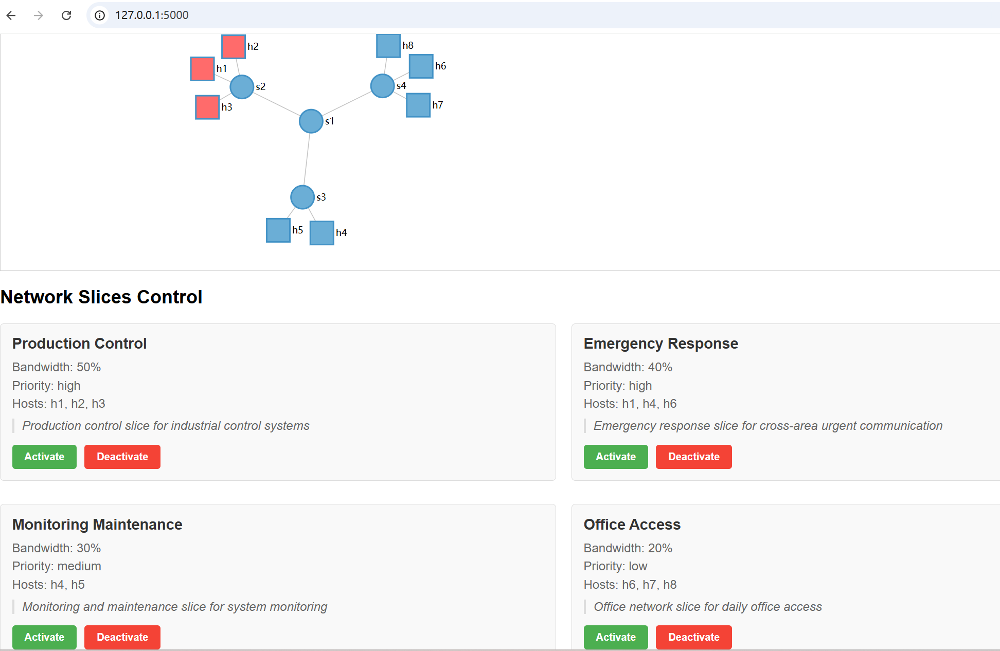
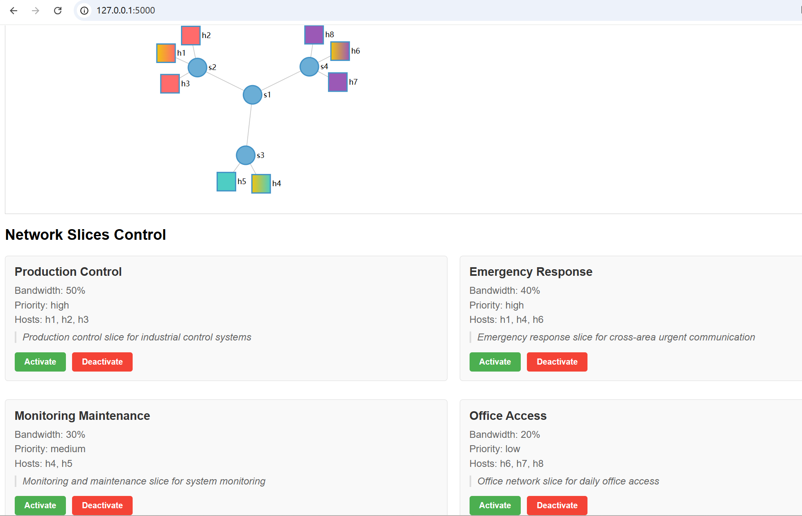
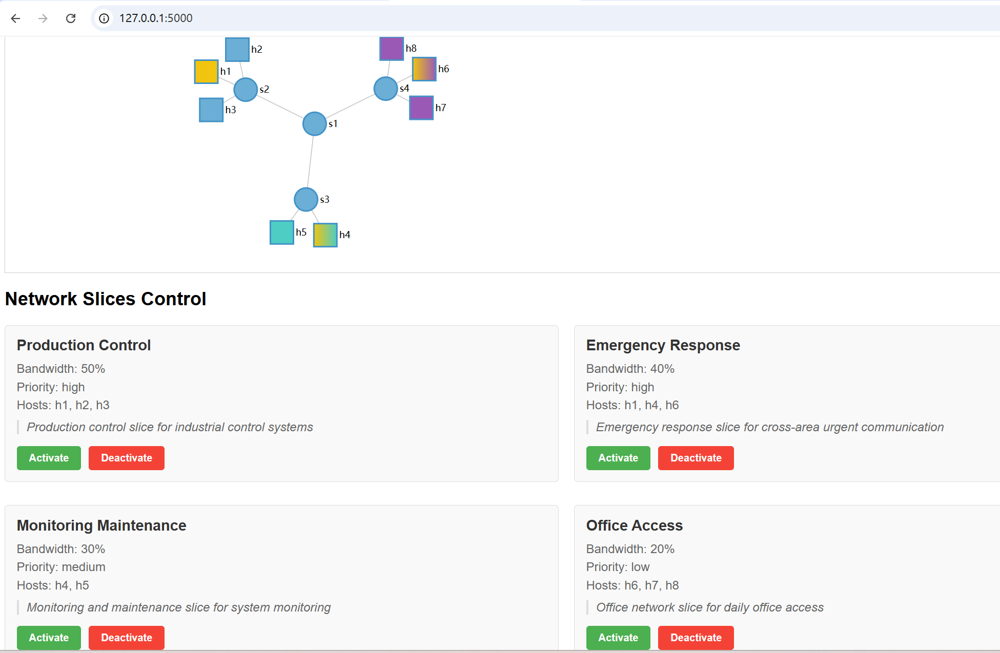

# Network Slicing with QoS Control

A Software-Defined Networking (SDN) solution that implements dynamic network slicing with QoS control. This project enables on-demand activation and deactivation of network slices through both CLI and GUI interfaces.

## Project Structure
```bash
├── slice_management.py  # Ryu controller application
├── topology.py  # Mininet topology definition
├── qos_manager.py  # QoS manager
├── gui.py  # Flask web server
├── static/
│   ├── css/
│   │   └── style.css  # GUI styling
│   └── js/
│       └── script.js  # Frontend logic
└── templates/
└── index.html  # Web interface template
```
## Features

- **Dynamic Network Slicing**: Activate and deactivate network slices on demand
- **QoS Control**: Bandwidth allocation and priority management for each slice
- **Web-based GUI**: Visual management interface for network slices
- **Real-time Visualization**: D3.js-based network topology visualization
- **REST API**: Full API support for slice management operations

## System Architecture

### Components

1. **SDN Controller (Ryu)**
   - Manages OpenFlow switches
   - Handles flow rule installation
   - Provides REST API endpoints

2. **Web Interface**
   - Flask-based web server
   - Interactive topology visualization
   - Slice management controls

3. **Network Topology**
   - Industrial network simulation
   - Multiple network areas (Production, Monitoring, Office)
   - QoS-enabled links

### Network Slices

- **Production Control** (50% bandwidth, High priority)
  - Industrial control systems
  - Real-time operations

- **Emergency Response** (40% bandwidth, High priority)
  - Cross-area urgent communication
  - Priority access during emergencies

- **Monitoring & Maintenance** (30% bandwidth, Medium priority)
  - System monitoring
  - Data collection

- **Office Access** (20% bandwidth, Low priority)
  - Regular office network access
  - Non-critical operations

## Prerequisites

- Python 3.+
- Ryu SDN Framework
- Mininet
- Flask
- D3.js (included)

## Usage

1. Clone the repository:
```bash
git clone <repository-url>
cd On_Demand_Slices/
```

2. Start the Ryu controller:
```bash
sudo ryu-manager slice_management.py
```

3. Start the network topology:
```bash
sudo python topology.py
```

4. Launch the web interface:
```bash
python gui.py
```

5. Access the GUI at `http://localhost:5000`

## API Endpoints

- `GET /api/topology` - Get network topology
- `GET /api/slices` - List all slices
- `POST /api/slices/<slice_name>/activate` - Activate a slice
- `POST /api/slices/<slice_name>/deactivate` - Deactivate a slice

## How to Verify Network Slice Activation/Deactivation

1. Initial State - Hosts in Network Topology are Not Connected by Default
```bash
mininet> pingall
*** Ping: testing ping reachability
h1 -> X X X X X X X
h2 -> X X X X X X X
h3 -> X X X X X X X
h4 -> X X X X X X X
h5 -> X X X X X X X
h6 -> X X X X X X X
h7 -> X X X X X X X
h8 -> X X X X X X X
*** Results: 100% dropped (0/56 received)
```
```bash
vagrant@comnetsemu:~$ sudo ovs-ofctl dump-flows s2
cookie=0x0, duration=1293.372s, table=0, n_packets=114, n_bytes=4788, priority=200,arp actions=NORMAL
cookie=0x0, duration=1293.372s, table=0, n_packets=70, n_bytes=5768, priority=0 actions=drop
```
2. Activate Slice - Select a Network Slice and Click Activate

```bash
mininet> h1 ping h2
PING 10.0.0.2 (10.0.0.2) 56(84) bytes of data.
64 bytes from 10.0.0.2: icmp_seq=1 ttl=64 time=1.14 ms
64 bytes from 10.0.0.2: icmp_seq=2 ttl=64 time=0.051 ms
^C
--- 10.0.0.2 ping statistics ---
2 packets transmitted, 2 received, 0% packet loss, time 1002ms
```
```bash
vagrant@comnetsemu:~$ sudo ovs-ofctl dump-flows s2
cookie=0x0, duration=1311.509s, table=0, n_packets=114, n_bytes=4788, priority=200,arp actions=NORMAL
cookie=0x0, duration=13.104s, table=0, n_packets=0, n_bytes=0, priority=50000,ip,nw_src=10.0.0.1,nw_dst=10.0.0.2 actions=NORMAL
cookie=0x0, duration=13.104s, table=0, n_packets=0, n_bytes=0, priority=50000,ip,nw_src=10.0.0.1,nw_dst=10.0.0.3 actions=NORMAL
cookie=0x0, duration=13.104s, table=0, n_packets=0, n_bytes=0, priority=50000,ip,nw_src=10.0.0.2,nw_dst=10.0.0.1 actions=NORMAL
cookie=0x0, duration=13.104s, table=0, n_packets=0, n_bytes=0, priority=50000,ip,nw_src=10.0.0.2,nw_dst=10.0.0.3 actions=NORMAL
cookie=0x0, duration=13.104s, table=0, n_packets=0, n_bytes=0, priority=50000,ip,nw_src=10.0.0.3,nw_dst=10.0.0.1 actions=NORMAL
cookie=0x0, duration=13.104s, table=0, n_packets=0, n_bytes=0, priority=50000,ip,nw_src=10.0.0.3,nw_dst=10.0.0.2 actions=NORMAL
cookie=0x0, duration=1311.509s, table=0, n_packets=70, n_bytes=5768, priority=0 actions=drop
```
3. Activate All Network Slices

```bash
mininet> pingall
*** Ping: testing ping reachability
h1 -> h2 h3 h4 X h6 X X
h2 -> h1 h3 X X X X X
h3 -> h1 h2 X X X X X
h4 -> h1 X X h5 h6 X X
h5 -> X X X h4 X X X
h6 -> h1 X X h4 X h7 h8
h7 -> X X X X X h6 h8
h8 -> X X X X X h6 h7
*** Results: 64% dropped (20/56 received)
```
4. Deactivate Slice - Select a Network Slice and Click Deactivate

```bash
mininet> pingall
*** Ping: testing ping reachability
h1 -> X X h4 X h6 X X
h2 -> X X X X X X X
h3 -> X X X X X X X
h4 -> h1 X X h5 h6 X X
h5 -> X X X h4 X X X
h6 -> h1 X X h4 X h7 h8
h7 -> X X X X X h6 h8
h8 -> X X X X X h6 h7
*** Results: 75% dropped (14/56 received)
```

## How to Verify Network Slice Bandwidth
1. Activate All Network Slices
2. Use iperf to test the bandwidth between hosts
```bash
mininet> h1 iperf -s &
mininet> h2 iperf -c h1 -t 10
------------------------------------------------------------
Client connecting to 10.0.0.1, TCP port 5001
TCP window size:  425 KByte (default)
------------------------------------------------------------
[  3] local 10.0.0.2 port 58348 connected with 10.0.0.1 port 5001
[ ID] Interval       Transfer     Bandwidth
[  3]  0.0-10.0 sec  5.62 GBytes  4.83 Gbits/sec
mininet> h4 iperf -c h1 -t 10
------------------------------------------------------------
Client connecting to 10.0.0.1, TCP port 5001
TCP window size:  442 KByte (default)
------------------------------------------------------------
[  3] local 10.0.0.4 port 53686 connected with 10.0.0.1 port 5001
[ ID] Interval       Transfer     Bandwidth
[  3]  0.0-10.0 sec  4.49 GBytes  3.85 Gbits/sec
mininet> h4 iperf -s &
mininet> h5 iperf -c h4 -t 10
------------------------------------------------------------
Client connecting to 10.0.0.4, TCP port 5001
TCP window size:  298 KByte (default)
------------------------------------------------------------
[  3] local 10.0.0.5 port 43492 connected with 10.0.0.4 port 5001
[ ID] Interval       Transfer     Bandwidth
[  3]  0.0-10.0 sec  3.37 GBytes  2.90 Gbits/sec
mininet> h6 iperf -c h4 -t 10
------------------------------------------------------------
Client connecting to 10.0.0.4, TCP port 5001
TCP window size: 85.3 KByte (default)
------------------------------------------------------------
[  3] local 10.0.0.6 port 53192 connected with 10.0.0.4 port 5001
[ ID] Interval       Transfer     Bandwidth
[  3]  0.0-10.0 sec  4.49 GBytes  3.86 Gbits/sec
mininet> h6 iperf -s &
mininet> h7 iperf -c h6 -t 10
------------------------------------------------------------
Client connecting to 10.0.0.6, TCP port 5001
TCP window size:  298 KByte (default)
------------------------------------------------------------
[  3] local 10.0.0.7 port 60720 connected with 10.0.0.6 port 5001
[ ID] Interval       Transfer     Bandwidth
[  3]  0.0-10.0 sec  2.19 GBytes  1.88 Gbits/sec
```
3. Some tc commands to check some QoS rules
```bash
mininet> h1 tc -s qdisc show dev h1-eth0
qdisc htb 1: root refcnt 2 r2q 10 default 2457 direct_packets_stat 0 direct_qlen 1000
 Sent 11366936666 bytes 7774117 pkt (dropped 2746, overlimits 21932 requeues 0)
 backlog 0b 0p requeues 0
qdisc fq_codel 10: parent 1:10 limit 10240p flows 1024 quantum 1514 target 999us interval 20.0ms memory_limit 256Kb ecn
 Sent 6319983308 bytes 4345978 pkt (dropped 1583, overlimits 0 requeues 0)
 backlog 0b 0p requeues 0
  maxpacket 68130 drop_overlimit 1583 new_flow_count 4467 ecn_mark 0 drop_overmemory 1583
  new_flows_len 0 old_flows_len 1
qdisc fq_codel 20: parent 1:20 limit 10240p flows 1024 quantum 1514 target 999us interval 20.0ms memory_limit 256Kb ecn
 Sent 5046952350 bytes 3428121 pkt (dropped 1163, overlimits 0 requeues 0)
 backlog 0b 0p requeues 0
  maxpacket 68130 drop_overlimit 1163 new_flow_count 4 ecn_mark 0 drop_overmemory 1163
  new_flows_len 0 old_flows_len 1

mininet> h1 tc -s class show dev h1-eth0
class htb 1:1 root rate 9Gbit ceil 9Gbit burst 90000Kb cburst 90000Kb
 Sent 11366936666 bytes 7774117 pkt (dropped 0, overlimits 0 requeues 0)
 backlog 0b 0p requeues 0
 lended: 0 borrowed: 0 giants: 0
 tokens: 1279999 ctokens: 1279999

class htb 1:999 parent 1:1 prio rate 1Mbit ceil 9Gbit burst 16Kb cburst 14625b
 Sent 1008 bytes 18 pkt (dropped 0, overlimits 0 requeues 0)
 backlog 0b 0p requeues 0
 lended: 18 borrowed: 0 giants: 0
 tokens: 2039250 ctokens: 217

class htb 1:10 parent 1:1 leaf 10: prio rate 5Gbit ceil 5Gbit burst 50000Kb cburst 50000Kb
 Sent 6319983308 bytes 4345978 pkt (dropped 662, overlimits 9365 requeues 0)
 backlog 0b 0p requeues 0
 lended: 297462 borrowed: 0 giants: 0
 tokens: 1279998 ctokens: 1279998

class htb 1:20 parent 1:1 leaf 20: prio rate 4Gbit ceil 4Gbit burst 40000Kb cburst 40000Kb
 Sent 5046952350 bytes 3428121 pkt (dropped 478, overlimits 12567 requeues 0)
 backlog 0b 0p requeues 0
 lended: 193141 borrowed: 0 giants: 0
 tokens: 1279997 ctokens: 1279997

class fq_codel 10:313 parent 10:
 (dropped 0, overlimits 0 requeues 0)
 backlog 0b 0p requeues 0
  deficit 826 count 0 lastcount 0 ldelay 1us
class fq_codel 20:24e parent 20:
 (dropped 0, overlimits 0 requeues 0)
 backlog 0b 0p requeues 0
  deficit 866 count 0 lastcount 0 ldelay 1us

mininet> h1 tc -s filter show dev h1-eth0
filter parent 1: protocol ip pref 1 u32 chain 0
filter parent 1: protocol ip pref 1 u32 chain 0 fh 800: ht divisor 1
filter parent 1: protocol ip pref 1 u32 chain 0 fh 800::800 order 2048 key ht 800 bkt 0 flowid 1:10 not_in_hw
  match 0a000002/ffffffff at 16
filter parent 1: protocol ip pref 1 u32 chain 0 fh 800::801 order 2049 key ht 800 bkt 0 flowid 1:10 not_in_hw
  match 0a000003/ffffffff at 16
filter parent 1: protocol ip pref 1 u32 chain 0 fh 800::802 order 2050 key ht 800 bkt 0 flowid 1:20 not_in_hw
  match 0a000004/ffffffff at 16
filter parent 1: protocol ip pref 1 u32 chain 0 fh 800::803 order 2051 key ht 800 bkt 0 flowid 1:20 not_in_hw
  match 0a000006/ffffffff at 16
filter parent 1: protocol ip pref 9 u32 chain 0
filter parent 1: protocol ip pref 9 u32 chain 0 fh 801: ht divisor 1
filter parent 1: protocol ip pref 9 u32 chain 0 fh 801::800 order 2048 key ht 801 bkt 0 flowid 1:999 not_in_hw
  match 00010000/00ff0000 at 8
```
